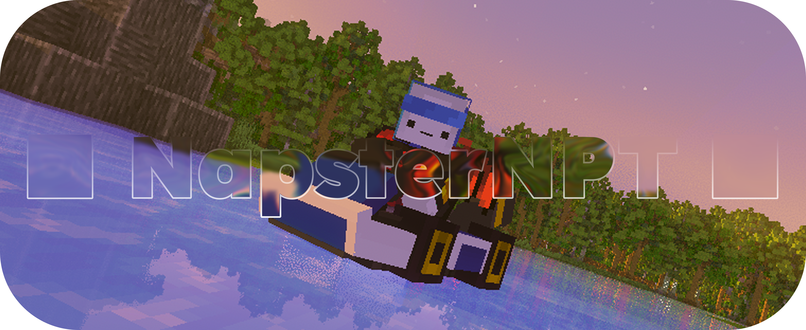

---

Hello, I'm **NapsterNPT**, an **Italian** silly developer. You can check all my projects on my **[Website](https://napsternpt.github.io)**, on my **[Modrinth Profile](https://modrinth.com/user/NapsterNPT)**, or, even simpler, on my **[GitHub](https://github.com/NapsterNPT?tab=repositories)**.

---

---

I'm currently working on **[Prixilium](https://GitHub.com/NapsterNPT/Prixilium)**, and you can see the process on the **[GitHub Project page](https://github.com/users/NapsterNPT/projects/2)**.

---

I must **thank you for being here**, and fun fact: I'm an ice boat racer.

---

Other cool things I know how to use:

